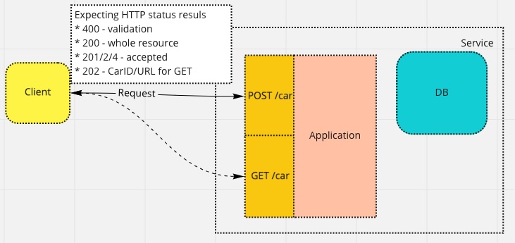
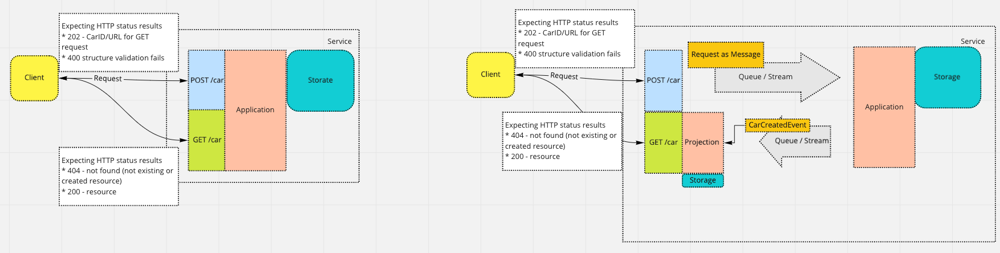
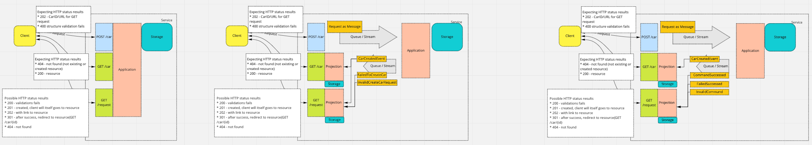
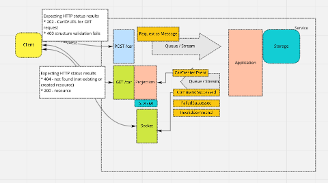
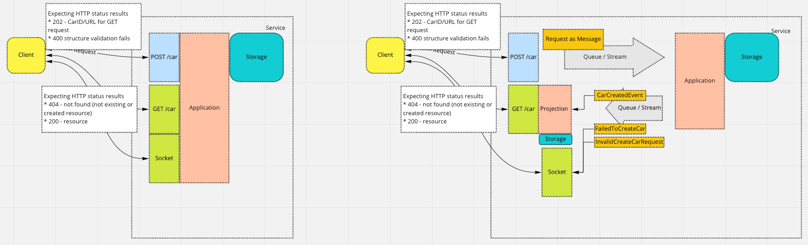

# 2. Provide async approach to handle requests 

Date: 2022-03-25

## Status

Discussed

## Context

Most project goes with scenario pushing request and expects to get in sync manner feedback with full results - full validation and execution of expected action. This changes with scale and complexity of system and became harder and harder. In this scenario, server for any `POST`, `PUT` or `PATCH` action return list of validation failed results or one of following:
* `200 OK` - The resource describing the result of the action is transmitted in the message body
* `201 Created` - success status response code indicates that the request has succeeded and has led to the creation of a resource.
* `204 No content` - success status response code indicates that a request has succeeded, but that the client doesn't need to navigate away from its current page.

Followed with failed validation:
* `400 Bad Request` - response status code indicates that the server cannot or will not process the request due to something that is perceived to be a client error

Current plan is to push any command with fully async manner. This requires initial accept all request by `202` HTTP code with correct structure. Business validation should be done later.
At same time build frontend flow that allow browser to know where search particular resource at end. 

Initial assumptions
* resource id will be assigned on client side, then we need to consider
  * validation of resource
    * structure
    * conflict with existing resource on id
    * business validation
  * landing resource URL should be generated on server side
* feedback will be sent async from service
  * if we should have one general message per service
  * or we should have separate messages for each commands

## Options

Criteria for us:
* coupling 
* supportability
* flexibility

First need to consider:
* what type of coupling could happen between client and service?
* what developer is required to add new functionality?
* how we can refactor particular part of system and what consequences it will have?

Overview of known strategies:

1. `pull` - client request particular endpoint to get know about his request/resource status
   1. `clients pull only final resource` - naive approach to pulling information from future resource path, skipping validation response steps.
   2. `clients pull request status from separate endpoint` - accepting endpoint, return path to resource contains status & related information (validation)
2. `push` - client sigh for particular medium (socket or topic) and is notified when change occurs (or not)
   1. `push universal message to client` - publishing message like `CommandSuccesed` etc for whole infrastructure
   2. `command related event` - publish event directly related to requested action (for `CrateCar` it will be `CarCreated`)
   3. `alerting bus` - we assume that command success always. If not, then receive particular message (universal or unique). Therefore, this is changes what we deliver, but strategy is similar to points 1. and 2.  

### Split in details in perspective of client

#### 1.1 Clients pull only final resource

* Summary
* SWOT
    * Strengths
      * quick
    * Weaknesses
    * Opportunities
    * Threats

#### 1.2 Clients pull request status from separate endpoint

* Summary
* SWOT
    * Strengths
        * quick
    * Weaknesses
    * Opportunities
    * Threats

#### 2.1 Push universal message to client

* Summary
* SWOT
    * Strengths
        * quick
    * Weaknesses
    * Opportunities
    * Threats
    
#### 2.2 Push related event to client

* Summary
* SWOT
  * Strengths
  * Weaknesses
  * Opportunities
  * Threats

## Notatkie

1. Return 202 Accepted with the location for non-existing yet resource to allow polling (client-side)
   -- this assumes that command will eventually succeeded
   -- there is no way to handle domain exceptions
2. Expose integration events related to aggregate guid to the client (CarCreated, CreatingCarFailed) which allow determining result of command processing
   -- actually hard and overcomp %licated
   -- need to introduce artificial events that do not denote any state change. On the other hand, if someone is interested in such event (the client), the event may be perceived as part of the domain space.
   -- exposing internal details up to client
3. Do not allow command to fail
   -- rather a naive approach
   -- can not even imagine how to guarantee this. I consider command fails due to violation domain constraints and retrying command will not help
   -- not each business scenario would support an alternative solution (adding customer to waiting list instead of reserving seats)
4. Introduce commands registry containing the status of each command and allow client to query the registry
   -- this seems to be the most convenient way to go.
5. Publishing CommandSucced(id)/CommandFailed(id) events (at application level, not domain)
   -- actually very close to 4. but maybe more explicit
6 Application/System/Alert bus with additional non-event messages (something that did not happend)
   -- enforce to differentiating messages on rather arbitrary factors

I would like to have clear HTTP status management. It is worth mentioning codes
* `202 Accepted` - response status code indicates that the request has been accepted for processing, but the processing has not been completed. 
  * Can contain URL to resource or request status 
* `301 Moved Permanently` - redirect status response code indicates that the requested resource has been definitively moved to the URL given by the Location headers.
* `400 Bad Request` - response status code indicates that the server cannot or will not process the request due to something that is perceived to be a client error
  * helpful if request will be successful to redirect it to resource itself
* `409 Conflict` - The HTTP 409 Conflict response status code indicates a request conflict with the current state of the target resource.
  * This can be useful if client try assign existing key to new resource.
* `410 Gone` - client error response code indicates that access to the target resource is no longer available at the origin server and that this condition is likely to be permanent.
  * helpful if request will be held as separate resource for clients for resource itself.

## Decision

## Consequences

What becomes easier or more difficult to do and any risks introduced by the change that will need to be mitigated.
